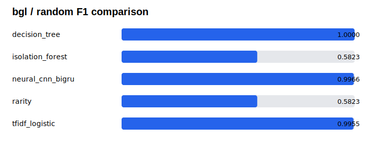
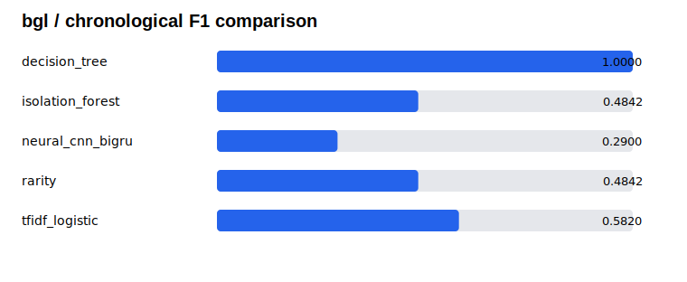
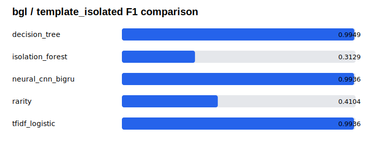

# BGL-500k 聚合基准结果

## 范围与可追溯性

本结果使用官方完整 BGL 原始日志文件按原始时间顺序截取的**固定前 500,000 行**，因此命名为 `BGL-500k`。它**不是完整 BGL**，不应被表述为完整数据集上的结果。

| 项目 | 固定值 |
| --- | --- |
| 原始来源 SHA256 | `666130b15ef44eb32fd02bd053e6c6e007c37696b5e7e8b9d8e45b729876a5d2` |
| prepared manifest SHA256 | `19f5f58667c16dd9530ab39baaf43c7b60979fd0a6ebefadf4e4569da6938ad2` |
| Task profile | `span_binary` |
| 窗口规则 | 按时间顺序、不重叠、每窗最多 64 行；共 7,813 窗，最后一窗 32 行 |
| 异常窗口 | 3,566 个 |
| split seed / 训练种子 | `20260712` / `20260711` |

切分后的 train / validation / test 窗口数分别为：random `4687 / 1563 / 1563`，chronological `4687 / 1562 / 1564`，template-isolated `3420 / 3372 / 1021`。所有词表、频率统计、温度和阈值均按固定协议仅在训练或验证数据上拟合。

## 测试集聚合指标

| Split | 模型 | Line F1 | Span F1 | Mean inclusive IoU |
| --- | --- | ---: | ---: | ---: |
| Random | Rarity | 0.5851 | 0.5823 | 0.9012 |
| Random | TF-IDF + logistic regression | 0.9995 | 0.9955 | 0.9990 |
| Random | Decision tree | 1.0000 | 1.0000 | 1.0000 |
| Random | Isolation Forest | 0.5851 | 0.5823 | 0.9012 |
| Random | CNN + BiGRU | 0.9997 | 0.9966 | 0.9999 |
| Chronological | Rarity | 0.5125 | 0.4842 | 0.9844 |
| Chronological | TF-IDF + logistic regression | 0.9030 | 0.5820 | 1.0000 |
| Chronological | Decision tree | 1.0000 | 1.0000 | 1.0000 |
| Chronological | Isolation Forest | 0.5125 | 0.4842 | 0.9844 |
| Chronological | CNN + BiGRU | 0.5837 | 0.2900 | 0.9440 |
| Template-isolated | Rarity | 0.4856 | 0.4104 | 0.9242 |
| Template-isolated | TF-IDF + logistic regression | 0.9998 | 0.9936 | 0.9993 |
| Template-isolated | Decision tree | 0.9998 | 0.9949 | 1.0000 |
| Template-isolated | Isolation Forest | 0.3260 | 0.3129 | 0.6662 |
| Template-isolated | CNN + BiGRU | 0.9997 | 0.9936 | 0.9985 |

对应的安全聚合表为 [random](random-summary.csv)、[chronological](chronological-summary.csv) 和 [template-isolated](template-isolated-summary.csv)。它们不含任何原始日志、准备后的样本、逐行预测或模型权重。

## 如何解读

- 随机切分的近乎满分不是主要证据：TF-IDF 与决策树同样接近满分，说明在此固定前缀和固定协议下，标签/模板高度可分。
- 时间切分才是关键压力测试。CNN + BiGRU 的 line/span F1 降为 **0.5837 / 0.2900**，而简单基线在若干指标上更高；神经模型并非全面领先。
- 模板隔离仍然很高，只能说明这个固定协议下的强可分性；它不能证明对新日志系统、格式或攻击模式的迁移能力。BGL→Thunderbird 的全正常迁移审计仍显示阈值不可直接迁移。
- Mean inclusive IoU 只在已经匹配到的重叠 span 上计算，不能单独解释成总体准确率，必须和 line/span F1 一起看。
- 聚合 CSV 只记录神经模型的训练耗时；缺少同条件的基线耗时，故不做跨模型速度横比。

## 公开边界

仓库只公开本目录的 CSV 与 SVG 聚合产物。原始 BGL、prepared 数据、逐行预测、checkpoint 和其他私有运行文件均不进入 Git 历史。
