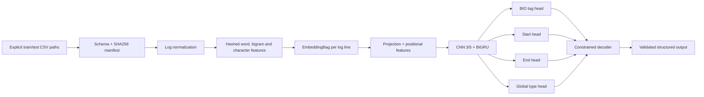

# Architecture

## Problem contract

Each sample contains an ordered sequence of log lines. The model emits five submission fields in addition to `id`:

1. `has_anomaly`: binary detection;
2. `primary_start_idx`: inclusive start line;
3. `primary_end_idx`: inclusive end line;
4. `primary_anomaly_type`: one of ten types or `none`;
5. `all_spans`: structured `start|end|type` text.

Normal rows must use `-1, -1, none, ""`. Schema validation runs before training and before writing predictions.

## Data flow

## Tensor shapes

For batch size `B`, maximum sequence length `L`, hidden size `H`, ten anomaly types and 21 BIO labels:

| Object | Shape |
|---|---|
| Flattened hashed token ids | `[N_tokens]` |
| EmbeddingBag line vectors | `[N_lines, E]` |
| Dense line features | `[B, L, H]` |
| BiGRU output | `[B, L, 2H]` |
| BIO tag logits | `[B, L, 21]` |
| Start logits | `[B, L, 10]` |
| End logits | `[B, L, 10]` |
| Global type/none logits | `[B, 11]` |

`pack_log_batch` also creates a Boolean mask and ten positional features per line. Padding labels use `-100` and are ignored by cross entropy.

## Feature layer

`features.py` removes leading timestamps, replaces IPs, hexadecimal values, paths, segment identifiers and standalone numbers with placeholders, then creates word, bigram and character tokens. CRC32 maps tokens into a fixed non-zero vocabulary range. Golden fixtures lock deterministic behavior across runs.

## Model and loss

`LogBoundaryNetwork` uses:

- `EmbeddingBag(mode="mean")` for variable token counts per line;
- a linear projection with LayerNorm, GELU and dropout;
- parallel width-3 and width-5 convolutions with a residual connection;
- a bidirectional GRU for sequence context;
- three line-level heads and one pooled global head.

The total loss combines weighted BIO cross entropy, start/end binary cross entropy and global type cross entropy. Sequence classes use inverse-square-root frequency weights; positive boundary weights compensate for sparse endpoints.

## Decoding and fold ensembling

Each fold produces tag, start, end and global logits. Inference validates checkpoint metadata, averages every head in logit space, rejects non-finite values, and then decodes once. The decoder:

1. applies a BIO transition matrix that forbids an inside tag from starting a sequence;
2. extracts inclusive typed spans;
3. optionally joins small gaps and adds endpoint candidates;
4. refines boundaries using tag, endpoint, global and length signals;
5. returns normal sentinels when no span survives.

Decoder tuning and locked evaluation use disjoint normalized-template groups. The current locked split is specifically a decoder-evaluation control; OOF fold models can still have trained on other rows belonging to the locked subset, and reports state this limitation explicitly.

## Module ownership

| Module | Responsibility |
|---|---|
| `schemas.py` | Strict dataframe and prediction rules |
| `features.py` | Deterministic normalization and hashing |
| `data.py` | Samples, labels, manifests, cache and batching |
| `model.py` | Multi-task network and class weights |
| `decode.py` | Structured span decoding |
| `tuning.py` | Decoder grids and tuning reports |
| `training.py` | Fold training, OOF outputs and checkpoint metadata |
| `inference.py` | Compatible checkpoint loading and fold averaging |
| `splitting.py` | Template groups and locked partitions |
| `metrics.py` | Official-style composite score |
| `presentation.py` | UI-independent line annotation |

## Private/public boundary

The public repository contains code, tests, synthetic fixtures, configurations and small metric manifests. Competition CSVs, raw logs, participant identifiers, caches, predictions and trained weights remain outside Git history. `.gitignore`, explicit paths and the publication audit provide complementary controls; none replaces a final manual review.
