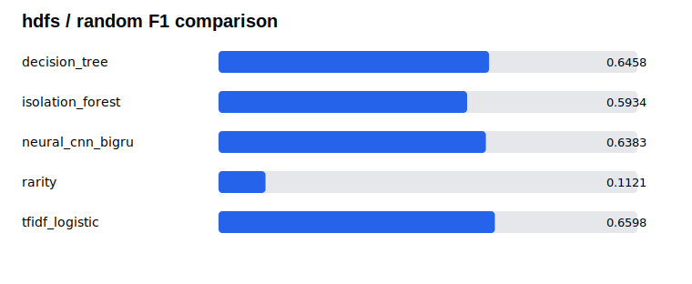
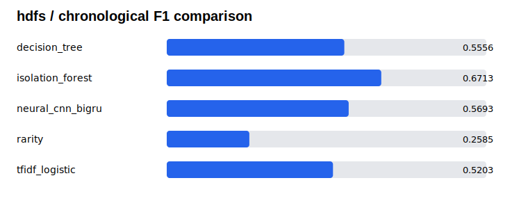
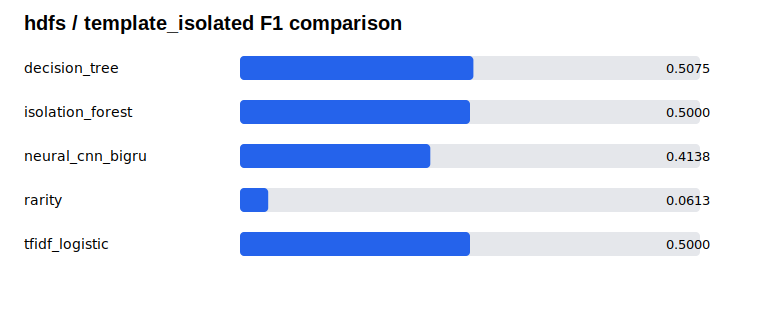

# 公开日志基准

## 目的

本项目将 ISCC 系统日志赛题中的多任务模型，扩展为可在公开数据上复现的日志异常检测与定位基准。公开实验和比赛成绩完全分开：比赛最终排名为 277，系统日志题官方 B 榜为 0.87111；公开基准中的任何数字都只能来自本仓库可追溯的实际运行。

## 数据与许可

第一阶段使用 Loghub 的 HDFS 与 OpenStack，第二阶段使用 BGL 与一个固定、可审计的 Thunderbird 子集。数据仅限本地下载和处理，不进入 Git 历史。使用者应遵循 [Loghub](https://github.com/logpai/loghub) 的研究/学术使用说明，并引用 Loghub 论文与各数据集 README 要求的原始论文。

仓库只保存：下载说明、源文件 SHA256、准备清单、配置、测试夹具、聚合指标与静态图表。它不保存原始日志、比赛数据、个人标识、缓存、权重或逐行预测。

## 任务协议

| Profile | 数据集 | 模型输出 | 不做什么 |
| --- | --- | --- | --- |
| `sequence_binary` | HDFS、OpenStack | 一段日志是否异常 | 不定位区间，不虚构十类 ISCC 标签 |
| `span_binary` | BGL、Thunderbird 子集 | 是否异常及异常行区间 | 不虚构公开数据不存在的异常类型 |

公开二分类模型复用现有日志规范化、EmbeddingBag、CNN、BiGRU、池化和边界预测思想，但在独立模块中训练。它不会把公开异常强行映射为 ISCC 的任一十分类。

## 可复现实验工作流

以下示例假设数据已按 Loghub 许可下载到仓库外的本地目录：

```powershell
seclog public-prepare `
  --dataset hdfs `
  --logs D:\public-log-datasets\raw\HDFS\HDFS.log `
  --labels D:\public-log-datasets\raw\HDFS\anomaly_label.csv `
  --output-dir D:\public-log-datasets\prepared\hdfs

seclog public-split `
  --prepared D:\public-log-datasets\prepared\hdfs\hdfs-sequence_binary.jsonl `
  --profile sequence_binary `
  --strategy random `
  --output D:\public-log-datasets\prepared\hdfs\random-split.json

seclog public-run-baseline `
  --prepared D:\public-log-datasets\prepared\hdfs\hdfs-sequence_binary.jsonl `
  --manifest D:\public-log-datasets\prepared\hdfs\hdfs-sequence_binary.manifest.json `
  --split D:\public-log-datasets\prepared\hdfs\random-split.json `
  --profile sequence_binary `
  --name tfidf_logistic `
  --output-dir outputs\public\hdfs-random

seclog public-train `
  --prepared D:\public-log-datasets\prepared\hdfs\hdfs-sequence_binary.jsonl `
  --manifest D:\public-log-datasets\prepared\hdfs\hdfs-sequence_binary.manifest.json `
  --split D:\public-log-datasets\prepared\hdfs\random-split.json `
  --profile sequence_binary `
  --config configs\public\hdfs-sequence.yaml `
  --output-dir outputs\public\hdfs-random
```

生成报告时，只能聚合同一数据清单、任务协议和切分策略下不同模型的结果：

```powershell
seclog public-report `
  --result outputs\public\hdfs-random\hdfs-random-tfidf_logistic-result.json `
  --result outputs\public\hdfs-random\hdfs-random-neural-result.json `
  --output-dir artifacts\public\hdfs-random
```

## 公平性与防泄漏

- 随机切分仅作为参考；时间切分和模板隔离切分是更强的泛化证据。
- 特征词表、稀有度统计、阈值、温度校准和解码选择只可使用训练集或验证集。
- BGL 与 Thunderbird 的窗口默认不重叠，同一原始日志行不能同时出现在不同分区。
- 缺少时间戳或模板分组时，命令会明确报错，而不会用别的切分方式冒充。
- 所有结果文件带有数据清单哈希；报告拒绝混合不同清单、任务或切分的结果。

## 指标

序列检测报告 Precision、Recall、F1、PR-AUC、ROC-AUC（定义时）、假阳性率与混淆矩阵。区间定位额外报告行级 PRF、区间 PRF、inclusive IoU 与精确边界正确率。神经模型在验证集上拟合温度校准并选择阈值；测试集只用于最终固定配置评分。

## 已验证结果（2026-07-11）

### HDFS 100k 公开子集

使用 LogPai Loglizer 公开的 `HDFS_100k.log_structured.csv` 与 HDFS 官方块级标签：104,815 行日志 → 7,940 个块序列，其中 313 个异常。完整来源 SHA256、每个模型的阈值、运行时间和全部聚合指标见 [HDFS 结果包](../artifacts/public/hdfs-100k/README.md)。

| Split | Neural F1 | Neural PR-AUC | Neural ROC-AUC | 同组最佳 F1 |
| --- | ---: | ---: | ---: | --- |
| Random | 0.6383 | 0.6570 | 0.9044 | TF-IDF + logistic regression: 0.6598 |
| Chronological | 0.5693 | 0.5536 | 0.7767 | Isolation Forest: 0.6713 |
| Template-isolated | 0.4138 | 0.4978 | 0.8886 | Decision tree: 0.5075 |







这些表并不把神经模型包装成每项第一：随机切分中线性模型 F1 略高；时间切分中 Isolation Forest 的固定阈值 F1 更好；模板隔离时神经模型 ROC-AUC 为 0.8886，但验证集阈值迁移后 F1 下降到 0.4138。这是一个可讲清楚的结论：排序能力、阈值校准和跨模板决策是不同问题，不能只展示最优随机 F1。

### BGL 2k 官方样本

Loghub 仓库随附的 `BGL_2k.log` 被用于端到端 span-localisation 集成验证：2,000 行 → 63 个非重叠窗口。它是小型官方样本，不代表完整 BGL 泛化；[结果包](../artifacts/public/bgl-2k/README.md)保留了所有模型的行级与区间级指标。该样本中 TF-IDF 的行级 F1 为 0.8571，CNN+BiGRU 为 0.3020，进一步说明小样本、标签前缀明显时简单基线可能更合适。

## 当前状态

公开数据协议、适配器、四类基线、二分类 CNN+BiGRU 路径、校准、报告器、真实 HDFS 100k 三切分实验，以及 BGL 2k 集成验证均已完成。下一阶段是完成完整 BGL 和固定 Thunderbird 子集的跨系统迁移；在此之前，仓库不会把 2k 集成样本包装成完整跨系统结论。
